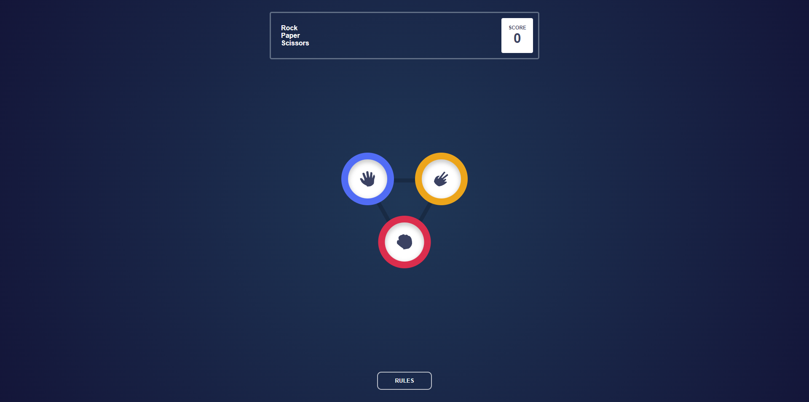

# Frontend Mentor - Rock, Paper, Scissors solution

This is a solution to the [Rock, Paper, Scissors challenge on Frontend Mentor](https://www.frontendmentor.io/challenges/rock-paper-scissors-game-pTgwgvgH). Frontend Mentor challenges help you improve your coding skills by building realistic projects.

## Table of contents

- [Overview](#overview)
  - [The challenge](#the-challenge)
  - [Screenshot](#screenshot)
  - [Links](#links)
- [My process](#my-process)
  - [Built with](#built-with)
  - [Continued development](#continued-development)
- [Author](#author)

**Note: Delete this note and update the table of contents based on what sections you keep.**

## Overview

### The challenge

Users should be able to:

- View the optimal layout for the game depending on their device's screen size
- Play Rock, Paper, Scissors against the computer
- Maintain the state of the score after refreshing the browser _(optional)_
- **Bonus**: Play Rock, Paper, Scissors, Lizard, Spock against the computer _(optional)_

### Screenshot

### Links

- Solution URL: [Frontend Mentor](https://www.frontendmentor.io/challenges/rock-paper-scissors-game-pTgwgvgH/hub)
- Live Site URL: [Live preview](https://bucolic-belekoy-c3d586.netlify.app/)
- Repo URL: [GitHub](https://github.com/jKm00/frontend-mentor/tree/rock-paper-scissors)

## My process

### Built with

- [SvelteKit](https://kit.svelte.dev/)
- [TypeScript](https://www.typescriptlang.org/)
- CSS custom properties defined at global level
- Mobile-first workflow

### Continued development

If I am to continue developing this project, I would look at the more advanded game mode with 5 options. I would like to add the possibility for the user to choose which game they would like to play.

## Author

- Website - [Joakim Edvardsen](https://edvardsen.dev/)
- Frontend Mentor - [jKm00](https://www.frontendmentor.io/profile/jKm00)

