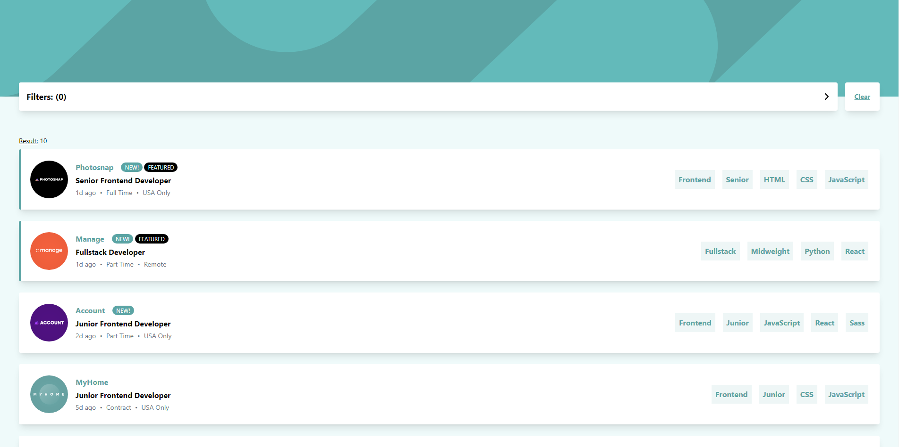

# Frontend Mentor - Job listings with filtering solution

This is a solution to the [Job listings with filtering challenge on Frontend Mentor](https://www.frontendmentor.io/challenges/job-listings-with-filtering-ivstIPCt). Frontend Mentor challenges help you improve your coding skills by building realistic projects.

## Table of contents

- [Frontend Mentor - Job listings with filtering solution](#frontend-mentor---job-listings-with-filtering-solution)
  - [Table of contents](#table-of-contents)
  - [Overview](#overview)
    - [The challenge](#the-challenge)
    - [Screenshot](#screenshot)
    - [Links](#links)
  - [My process](#my-process)
    - [Built with](#built-with)
    - [What I learned](#what-i-learned)
  - [Author](#author)

**Note: Delete this note and update the table of contents based on what sections you keep.**

## Overview

### The challenge

Users should be able to:

- View the optimal layout for the site depending on their device's screen size
- See hover states for all interactive elements on the page
- Filter job listings based on the categories

### Screenshot

### Links

- Solution URL: [Add solution URL here](https://your-solution-url.com)
- Live Site URL: [https://clinquant-frangollo-944b39.netlify.app/](https://clinquant-frangollo-944b39.netlify.app/)

## My process

### Built with

- SvelteKit
- Tailwind CSS
- TDD with vitest

### What I learned

- Getting more familiar with sveltekit and how to do proper fetching with filters saved in the url.
- Also focused on how to properly test frontend code.

## Author

- Website - [Joakim Edvardsen](https://edvardsen.dev/)
- Frontend Mentor - [@jKm00](https://www.frontendmentor.io/profile/jKm00)
