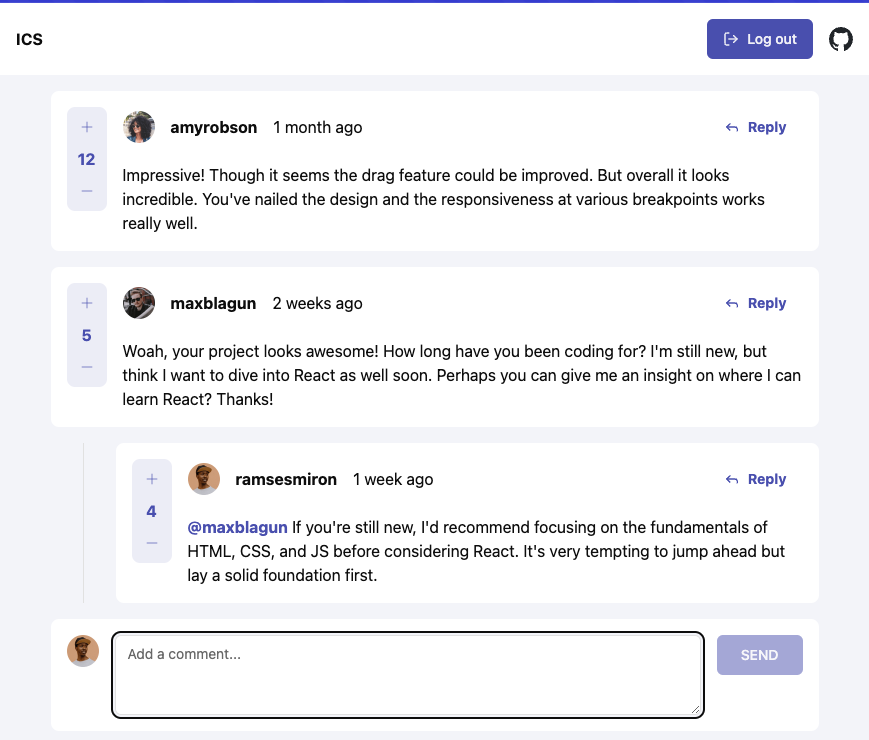

# Frontend Mentor - Interactive comments section solution

This is a solution to the [Interactive comments section challenge on Frontend Mentor](https://www.frontendmentor.io/challenges/interactive-comments-section-iG1RugEG9). Frontend Mentor challenges help you improve your coding skills by building realistic projects.

## Table of contents

- [Overview](#overview)
  - [The challenge](#the-challenge)
  - [Screenshot](#screenshot)
  - [Links](#links)
- [My process](#my-process)
  - [Built with](#built-with)
  - [Continued development](#continued-development)
- [Author](#author)

## Overview

### The challenge

Users should be able to:

- View the optimal layout for the app depending on their device's screen size
- See hover states for all interactive elements on the page
- Create, Read, Update, and Delete comments and replies
- Upvote and downvote comments
- **Bonus**: If you're building a purely front-end project, use `localStorage` to save the current state in the browser that persists when the browser is refreshed.
- **Bonus**: Instead of using the `createdAt` strings from the `data.json` file, try using timestamps and dynamically track the time since the comment or reply was posted.

### Screenshot

### Links

- Solution URL: [https://www.frontendmentor.io/solutions/interactive-comment-section-with-sveltekit-and-tailwind-cB78o0-5ZS](https://www.frontendmentor.io/solutions/interactive-comment-section-with-sveltekit-and-tailwind-cB78o0-5ZS)
- Live Site URL: [https://charming-banoffee-a45fde.netlify.app/login](https://charming-banoffee-a45fde.netlify.app/login)

## My process

### Built with

- Sveltekit
- Sveltekit flash messages
- Shadcn w/ Tailwind
- Mobile-first workflow

### Continued development

Store data in persistant storage like a database. Replace CRUD operations to use the database instead of memory objects.

## Author

- Website - [Joakim Edvardsen](https://www.edvardsen.dev/)
- Frontend Mentor - [@jKm00](https://www.frontendmentor.io/profile/jKm00)
- GitHub - [@jKm00](https://github.com/jKm00)
